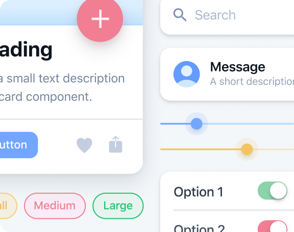

<!-- markdownlint-disable no-inline-html first-line-h1 -->

<p align="center">
  
</p>

# :dart: Component driven development [Go Back](README.md)

## What is Component driven development?

A development methodology that anchors the build process around components. It is a process that builds UIs from the “bottom up” by starting at the level of components and ending at the level of pages or screens

Ionic is a component-based framework, which means that it is built around reusable components.
Example of a component:

```html
<ion-button></ion-button>
```

Check out list [component](https://ionicframework.com/docs/components) guide.

### Note
A component is a reusable piece of UI that can be used in multiple places in your app.
So when see you are repeating the same piece of UI code, you should create a component from that code and use it in multiple places.
