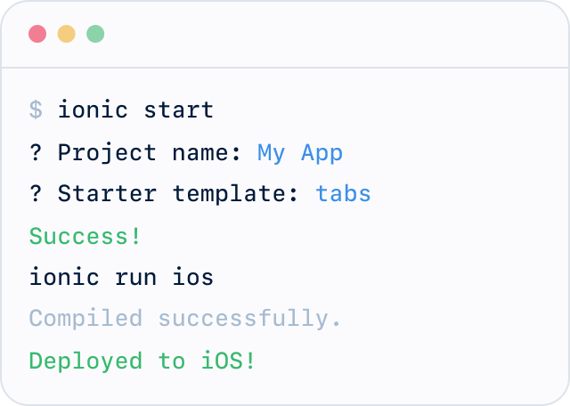

<!-- markdownlint-disable no-inline-html first-line-h1 -->

<p align="center">
  
</p>

# :dart: Get started [Go Back](README.md)

## Install the Ionic CLI

Before proceeding, make sure your computer has Node.js installed. See these instructions to set up an environment for Ionic.

Install the Ionic CLI with npm:

```bash
npm install -g @ionic/cli
```

If there was a previous installation of the Ionic CLI, it will need to be uninstalled due to a change in package name.

```bash
npm uninstall -g ionic
npm install -g @ionic/cli
```

## Create a new app

Create an Ionic app using one of the pre-made app templates, or a blank one to start fresh. The three most common starters are the blank starter, tabs starter, and sidemenu starter. Get started with the ionic start command:

```bash
  ionic start <myApp> --type=angular --capacitor
  ionic start <myApp> --type=react --capacitor
  ionic start <myApp> --type=vue --capacitor
```

To learn more about starting Ionic apps, see the [Starting Guide](<https://ionicframework.com/docs/developing/starting>).

Pick a framework or library to start with.
 [Angular](<https://ionicframework.com/docs/angular/your-first-app>) or [React](<https://ionicframework.com/docs/react/your-first-app>) or [Vue](<https://ionicframework.com/docs/vue/your-first-app>).

## Build and run your app

The majority of Ionic app development can be spent right in the browser using the ionic serve command:

```bash
  cd <myApp>
  ionic serve
```

There are a number of other ways to run an app, it's recommended to start with this workflow. To develop and test apps on devices and emulators, see the [Running an App Guide](https://ionicframework.com/docs/developing/previewing).
