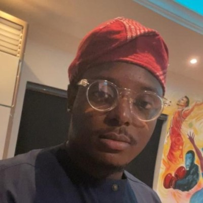

<!-- markdownlint-disable no-inline-html first-line-h1 -->

<p align="center">
  
</p>

<h1 align="center">Advance Ionic Training</h1>

Welcome to Modus! Advance Ionic Training

## Major Topic to capture

- Introduction
- Getting started [link](GETSTARTED.md)
- Styling and theming ionic apps [link](STYLE.md)
- Component driven development (Smart) [link](COMPONENT.md)
- Ionic PWA (capacitor) [link](IONIC-PWA.md)
- Typescript [link](TYPESCRIPT.md)
- Forms [link](FORMS.md)
- Capacitor. [link](CAPACITOR.md)
- Other (Deployment and Testing) [link](TESTING.md)
- Electron. [link](ELECTRON.md)

- Ionic Modus Training  [link](TRAINING.md)

## Introduction

<p align="left">
  
</p>

```bash
My name is Dansteve Adekanbi,
and I am a Full-Stack Software Engineer at Modus Create with over eight years of experience.
I have a Bachelor’s degree in Computer Science.
my main tech stack consists of Ionic, Typescript, Javascript, Angular,
React, Vue Js, Node, Java, and SQL databases.
Mobile development is my passion;
```

In other words: you can check me out on the following links
***[Portfolio](https://drive.google.com/file/d/1trHFqrduO2-enycMjYXZZ8i30NbcbY6h/view?usp=sharing)***
***[Linkedin](https://www.linkedin.com/in/dansteve-adekanbi/)***

## Getting started

### Use VS Code

Development is done on Mac or windows with [Visual Studio Code](https://code.visualstudio.com/) as the IDE. This is a. There are shared [settings](.vscode/settings.json) and [extensions](.vscode/extensions.json).

:dart: ***PRO TIP: See [All my extension](.vscode/all-extensions.json).***
