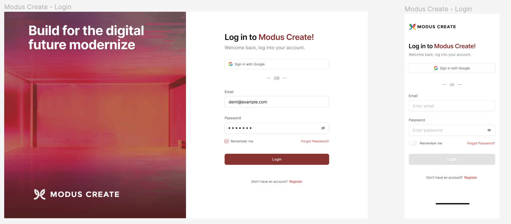

<!-- markdownlint-disable no-inline-html first-line-h1 -->

  

# :dart: Smart layout with [Go Back](README.md)

## Welcome To smart layout workshop

[Link to figma](<https://www.figma.com/file/9f8UteOam2V85oZrX5TYqX/Modus-Create>)

