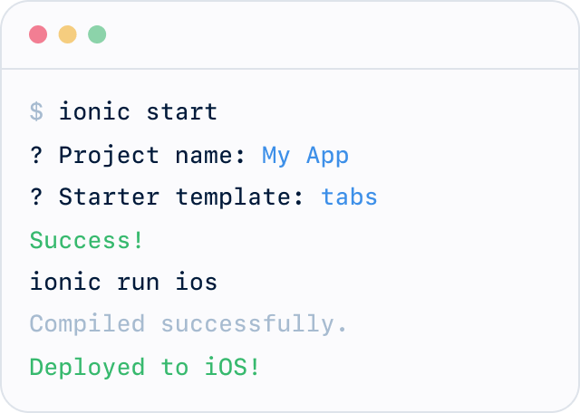

<!-- markdownlint-disable no-inline-html first-line-h1 -->

<p align="center">
  
</p>

# :dart: Getting started [Go Back](README.md)

:dart: ***PRO TIP: [Type everything](https://www.typescriptlang.org/docs/handbook/interfaces.html).***

## App Translations

Use [`@ngx-translate`](https://github.com/ngx-translate/core) to translate content for each locale.

Locales may have one or more translation files. Save these files in the `i18n/` folder in each locale. The file name is usually `{iso language code}-{ISO COUNTRY CODE}.json`. Examples: [`en-US.json`](src/assets/i18n/en-US.json), [`es-MX.json`](src/assets/i18n/es-MX.json).

Store translations as key-value pairs. Keys are always CONSTANT CASE. Values can include [placeholders](https://github.com/ngx-translate/core#4-define-the-translations) and [HTML](https://github.com/ngx-translate/core#6-use-html-tags) if needed.

### Static Content

Store static content like IDs and URLs in translation files. Static content has a `_STATIC` suffix at the end of the key name. Example:

```json
"INFORMATION": {
  "DATA": [
    {
      "DURATION": "5-7 minutes",
      "DATA_LIST": [
        "something",
        "something"
      ],
      "IMG_STATIC": "assets/img/some.svg",
      "ID_STATIC": "data",
      "DATA_LABEL": "Data",
    },
  ]
}
```

### Coding Patterns (App Translation)

You can use any of `@ngx-translate`'s [recommendations](https://github.com/ngx-translate/core#5-use-the-service-the-pipe-or-the-directive), but the `TranslateService` and `TranslatePipe` are most common.

## Date and Time

[Unix timestamps](https://en.wikipedia.org/wiki/Unix_time) and custom formats are hard to work with. Always use an [`ISOTimestamp`](src/types/iso.d.ts) when saving dates and times.

### Delete Dead Code

Always delete [dead code](https://en.wikipedia.org/wiki/Dead_code). Use [git-diff](https://git-scm.com/docs/git-diff) to restore old code as needed.

### Avoid Code Comments

Code comments are an [anti-pattern](https://kentcdodds.com/blog/please-dont-commit-commented-out-code). Use [Descriptive and Meaningful Phrases](#descriptive-and-meaningful-phrases) instead.

### Avoid the Wrong Abstraction

Duplicating code is better than abstracting code in the wrong way. See [this article](https://sandimetz.com/blog/2016/1/20/the-wrong-abstraction) for why.

### Use Doc Blocks

Consider adding [JSDocs](https://jsdoc.app/) for your public APIs. While not required, doc blocks are a good [developer experience](https://medium.com/swlh/what-is-dx-developer-experience-401a0e44a9d9). They help devs understand what an API does and why they might use it. Examples:

- [`datetime.pipe.const.ts`](src/app/pipes/datetime/datetime.pipe.const.ts)
- [`functional.ts`](src/app/utils/functional.ts)
- [`loqui.plugin.definitions.ts`](src/app/plugins/loqui.plugin.definitions.ts)
- [`primitives.d.ts`](src/types/primitives.d.ts)

Also consider adding [`@example`](https://jsdoc.app/tags-example.html) use cases in your doc blocks.

```ts
/**
 * Returns the sum of two numbers. Same as `y + x`.
 *
 * @example
 *
 * ```ts
 * add(3)(6);
 * // => 9
 * ```
 */
export const add = (x: number) => (y: number) => y + x;
```

## Coding Patterns (TypeScript)

Please follow [some recommendations](https://betterprogramming.pub/6-typescript-code-patterns-to-make-your-code-more-robust-bbe54354f39f) for TypeScript in addition to the items below.
Please see [Checksheet](https://www.typescriptlang.org/cheatsheets)

### Immutable Data

Mutated data is hard to work with. Use [immutable data](https://en.wikipedia.org/wiki/Immutable_object) instead.

```ts
// GOOD ✔
const list: ReadonlyArray<number> = [1, 2, 3, 0, 4, 5];
const newList: ReadonlyArray<number> = [...list, 6, 7, 8];

// GOOD ✔
const list: readonly number[] = [1, 2, 3, 0, 4, 5];
const newList: readonly number[] = list.concat([6, 7, 8]);

// AVOID ✘
let list = [1, 2, 3, 0, 4, 5];
list.push(6, 7, 8);
```

### Pure Functions

[Pure functions](https://en.wikipedia.org/wiki/Pure_function) are easy to test and work well with immutable data. They're also easy to [pipe](https://en.wikipedia.org/wiki/Function_composition) and [curry](https://en.wikipedia.org/wiki/Currying). Pure functions always return a value.

```ts
// Good ✔
const add = (a: number, b: number) => a + b;

// Good ✔
const add = (a: number) => (b: number) => a + b;

// Avoid ✘
const add = (a: number) => a + magicNumberFromSomewhere;

// Avoid ✘
const add = () => magicNumberFromSomewhere + magicNumberFromSomewhereElse;
```

### Data First / Data Last

Passing data as the [last argument](https://dev.to/richytong/practical-functional-programming-in-javascript-data-last-1gjo) of a function is great for piping and currying, but TypeScript's typing system works best when we pass in data as the [first argument](https://basarat.gitbook.io/typescript/type-system/type-inference).

Write Data-First functions when possible. Make your code clear at the [Point of Use](#descriptive-and-meaningful-phrases).

```ts
// GOOD ✔
const apply = (data, fn) => fn(data);

// GOOD ✔
const apply = (fn) => (data) => fn(data);

// AVOID ✘
const apply = (config, data, fn) => fn(data, config);

// AVOID ✘
const apply = (fn) => (data) => (config) => fn(data, config);
```

### Descriptive And Meaningful Phrases

Abbreviations are hard to work with. Make your code easy to read. Use [Descriptive And Meaningful Phrases](https://medium.com/mutual-of-omaha-digital-experience-and-design-team/damp-programming-reviving-readability-d84647cc5b2e).

```ts
// GOOD ✔
if (isNotToday(timestamp)) {
  this.request.attributes.startTime = formatStartTime(timestamp);
  this.request.attributes.endTime = formatEndTime(timestamp);
}

// AVOID ✘
if (moment(startTime).format('dddd') !== moment().format('dddd')) {
  this.request.attributes.startTime = moment(startTime).set('hour', this.TWELVE).startOf('hour').toISOString();
  this.request.attributes.endTime = moment(startTime).set('hour', this.THIRTEEN).startOf('hour').toISOString();
}
```

### Parameter Defaults

Any argument with a single common value is a candidate for a default.

```ts
// GOOD ✔
const api = (endpoint, path = "foo/bar/baz") => {
  return `${path}/${endpoint}`;
};

// AVOID ✘
const api = (endpoint, path?) => {
  return path ? `${path}/${endpoint}` : `foo/bar/baz/${endpoint}`;
};
```

### Private Members, Local Variables

Use [private class members](https://www.typescriptlang.org/docs/handbook/2/classes.html#private) and [local variables](https://developer.mozilla.org/en-US/docs/Glossary/Local_variable) when possible. This makes it easy to delete [dead code](https://en.wikipedia.org/wiki/Dead_code).

### Utility Functions and Types

Store global utility functions in the [`src/app/utils/functional.ts`](src/app/utils/functional.ts) file. Local pages and providers may have their own utilities stored in their own `*.utils.ts` file.

Store global utility types in the [`src/types/`](src/types) folder. Local pages and providers may have their own utilities stored in their own `*.const.ts` or `*.types.ts` file.

Use standard `import` statements to use utilities and types in your code. Examples:

```ts
import { keys2array, isNil } from '../../utils/functional';
import type { FlattenArray } from '../../utils/types';
```

#### Writing Utility Functions

Always follow our [Coding Patterns](#coding-patterns-typescript) for TypeScript when writing utilities.

Utilities should not be Providers and should not be part of Angular's dependency injection. Utilities are an easy way to break out simple business logic into their own files. Example:

- [`symptom-tracker.utils.ts`](src/app/pages/symptom-tracker/symptom-tracker.utils.ts)

### Avoid Function Statements

Function statements don't return values and make code hard to work with. Functions should [return a value](#pure-functions). Use function statements strategically.

```ts
// Good ✔
export class FooPage {
  public messages: ReadonlyArray<Message>;

  constructor(
    private service: Service
  ) {
    // noop
  }

  public onPageLoad() {
    const data = this.service.getData();
    this.messages = this.removeEmptyItems(data);
  }

  private removeEmptyItems(data) {
    // Returns filtered data ✔
  }
}

// Avoid ✘
export class FooPage {
  public messages: ReadonlyArray<Message>;

  constructor(
    private service: Service
  ) {
    // noop
  }

  public onPageLoad() {
    this.messages = this.service.getData();
    this.removeEmptyItems();
  }

  private removeEmptyItems() {
    // Does not return data ✘
  }
}
```

### Avoid Else Blocks

Skip the `else` block if your `if` block always executes a return statement. This makes your code easier to read.

```ts
// Good ✔
const hello = (name) => {
  if (name) {
    return '👋';
  }

  return '👻';
};

// Good ✔
const hello = (name) => name ? '👋' : '👻';

// Avoid ✘
const hello = (name) => {
  if (name) {
    return '👋';
  } else {
    return '👻';
  }
};
```

### Avoid Nested Conditionals

Nested [conditional statements](https://developer.mozilla.org/en-US/docs/Learn/JavaScript/Building_blocks/conditionals) can be hard to work with. Use them strategically. Consider using a flat structure or eliminate the conditionals.

```ts
// Good ✔
const getFullPath = (endpoint, isAuthenticated) => {
  if (isAuthenticated && endpoint === 'dashboard') {
    return `/user/auth/${endpoint}`;
  }

  if (isAuthenticated && endpoint !== 'dashboard') {
    return `/user/auth/account/${endpoint}`;
  }

  return `/guest/${endpoint}`;
}

// Good ✔
const getAuthenticatedPath = (endpoint) => {
  return (endpoint === 'dashboard') ? `/user/auth/${endpoint}` : `/user/auth/account/${endpoint}`;
}

const getUnauthenticatedPath = (endpoint) => {
  return (endpoint === 'dashboard') ? `/guest/${endpoint}` : `/guest/account/${endpoint}`;
}

const getFullPath = (endpoint, isAuthenticated) => {
  return (isAuthenticated) ? getAuthenticatedPath(endpoint) : getUnauthenticatedPath(endpoint);
}

// Avoid ✘
const getFullPath = (endpoint, isAuthenticated) => {
  if (isAuthenticated) {
    if (endpoint === 'dashboard') {
      return `/user/auth/${endpoint}`;
    }

    if (endpoint !== 'dashboard') {
        return `/user/auth/account/${endpoint}`;
    }
  }

  return `/guest/${endpoint}`;
}

// Good ✔
const status = (!isNil(status) && !isEmptyString(status.trim()) ? status : getStatusMessageFrom(schedule);

// Avoid ✘
const status = (!isNil(status) && !isEmptyString(status.trim()) ? status : ((moment(schedule.doseDate) > moment(new Date())) ||
  (schedule.doseDate.includes(this.formatDate(new Date())) && (Number(schedule.doseTime.substring(0, TWO)) > new Date().getHours())) ||
  (schedule.doseDate.includes(this.formatDate(new Date())) && (Number(schedule.doseTime.substring(0, TWO)) === new Date().getHours()) &&
    (Number(schedule.doseTime.substring(THREE, FIVE)) > new Date().getMinutes()))) ? 'Upcoming' : 'Missed');
```

### Avoid Generic Type Annotations

Generic [type annotations](https://www.typescriptlang.org/docs/handbook/2/everyday-types.html) like `any` and `string` can be hard to work with. They prevent type safety and stop Intellisense from working correctly. Use [type aliases](https://www.typescriptlang.org/docs/handbook/2/everyday-types.html#type-aliases), [interfaces](https://www.typescriptlang.org/docs/handbook/2/everyday-types.html#interfaces), and [nominal types](#nominal-types) when possible.

```ts
// Good ✔
export interface CommonListItem {
  ID: UUIDString;
  TIMESTAMP: ISOString;
}

// Good ✔
private getNotificationSettings(response: CustomEventResponse) {
  // ...
}

// Avoid ✘
export interface CommonListItem {
  ID: string;
  TIMESTAMP: string;
}

// Avoid ✘
private getNotificationSettings(response: any) {
  // ...
}
```

#### Nominal Types

Store all Nominal Types as [declaration files](https://www.typescriptlang.org/docs/handbook/declaration-files/introduction.html) in the [`src/types/`](src/types) folder. Add new files and types as needed.

Nominal Types add symantic meaning to what would otherwise be a generic type. This makes it easy to tell the difference between things like timestamps and UUIDs when reading and writing code.

Nominal Types come in two flavors: **Flexible** and **Strict**.

Intellisense treats **Flexible Nominal Types** as unique, but TypeScript treats them as equivalent to their underlying generic type. This prevents compile time errors and preserves backward compatabilty with existing code. Use a Flexible Nominal Type when in doubt.

```ts
type Foo = Nominal<'Foo', string>;
type Bar = string;

Foo === Bar
// => true
```

Both Intellisense and TypeScript treat **Strict Nominal Types** as unique. They are never equivalent to their underlying generic type. This breaks backward compatibility with existing code, but guarantees an extra level of type safety. Use Strict Nominal Types with caution.

```ts
type Foo = NominalStrict<'Foo', string>;
type Bar = string;

Foo === Bar
// => false
```

:dart: ***PRO TIP: Learn more about [Flexible Nominal Types](https://spin.atomicobject.com/2018/01/15/typescript-flexible-nominal-typing/) and [Strict Nominal Types](https://www.typescriptlang.org/play#example/nominal-typing).***

### Avoid Generic Log Output

Cluttered browser consoles are hard to work with. Use `console.log()`create a custom logger class

### Use custom to Log Warnings and Errors

Use any custom logger class to log warnings and errors to the console. Warnings and errors are for long-term reference and help the whole development team.

```ts
// Good ✔
public async saveProblemList() {
  await this.userProvider.updateAttributesAsync().catch(msg => this.logger.error(msg));
}

// Good ✔
public isPlatformiOS() {
  if (!this.platform.is('cordova')) {
    this.logger.warn('[AppConfigProvider] Cordova not detected, try running on physical device or simulator');
    return false;
  }
}

// Avoid ✘
public async saveProblemList() {
  await this.userProvider.updateAttributesAsync().catch(msg => console.error(msg));
}
```

:dart: ***PRO TIP: Take ownership of the errors and warnings you see in the console. Fix what you can or leave a `TODO` comment for future reference.***

### Naming Conventions for Functions

TSLint enforces `camelCase` for all function names. While any [Descriptive and Meaningful Phrase](#descriptive-and-meaningful-phrases) is valid, we reserve the following suffixes for special uses:

- Add a trailing `$` to all [Observables](https://rxjs.dev/guide/observable). This aligns with [standard practice](https://angular.io/guide/rx-library#naming-conventions-for-observables) for Angular.

  ```ts
  public healthConcerns$: Observable<ReadonlyArray<HealthConcern>>;
  ```

- Add a trailing `$$` to all [Subjects](https://rxjs.dev/guide/subject). This makes it easy to tell the difference between Subjects and Observables.

  ```ts
  private inputChanged$$: Subject<null> = new Subject<null>();
  ```


### For more typescript cheat sheets

check out the typescript-cheat-sheets folder or visit [TypeScript Cheat Sheet](https://www.typescriptlang.org/docs/handbook/cheat-sheet.html);